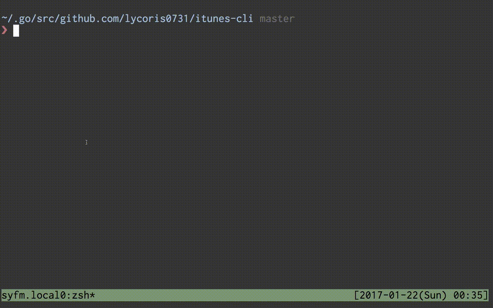

# iTunes CLI
[](LICENSE)  
Command line interface for control iTunes

  

===

## Description  
You can control iTunes operations from command line.  

## Equipments
- macOS Sierra or later
- iTunes 12.5.4 or later
- Go
- One of fuzzy finders

## Installation
``` sh
$ go get github.com/lycoris0731/itunes-cli/itunes
```

And you need to set environment variables for fuzzy-search.  
``` sh
$ export ITUNES_CLI_FUZZY_TOOL="fzf"
```

## Usage
Each sub-commands can use shorter name.  
Please see `$ itunes help`.  

### Play
Play current selected music.  
``` sh
$ itunes play
```

Play music that name passed by a argument.
``` sh
$ itunes play reunion
```

### Pause
Pause current music
``` sh
$ itunes pause
```

Replay current music or play previous music.  
If playing music's current played time is a few second, play previous music.  
Other than that, replay it music from beginning.  
``` sh
$ itunes back
```

### Next/Previous
Play next music.  
``` sh
$ itunes next
```

Play previous music.  
``` sh
$ itunes prev
```

### Volume
Change volume in iTunes.  
``` sh
$ itunes vol 20
```

### Find music
You can find musics by music name (or playlist) by fuzzy-search(fzy, fzf, peco, etc)
``` sh
$ itunes find
$ itunes find plist
```

## License
Please see LICENSE.
